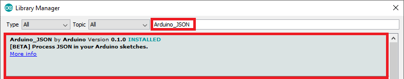

# IoTLand ESP8266
Library for operating IoTLand via ESP8266 based module! 

**This Library Based On [Arduino_Json.](https://github.com/arduino-libraries/Arduino_JSON "Arduino_Json.")**
So You must have to install Arduino_Json library installed in your Arduino IDE.

You can Add **Arduino_Json** from from your Arduino Libary Manager or You can Download it from [GitHub](https://github.com/arduino-libraries/Arduino_JSON "GitHub")


## Installation of IoTLand ESP8266

1) [Download](https://github.com/aididalam/IoTLand_Esp8266/archive/main.zip) the source code from GitHub.  
2) Unzip and rename the Folder name to "IoTLand".  
3) Paste it in your Library folder (Usually located somewhere at documents/Arduino/libraries).  
4) Restart the Arduino IDE.  


## Usage

### Include the library
```c++
#include <IoTLand.h>  
```

### Initiazing IoTLand Library
```c++
/*
 * Library needs Api key and Componant Id.
 * So login to your IotLand controll panel and get apikey and componant id.
 */
String apikey = "YOUR_PROJECTS_API_KEY";
IoTLand iotland(apikey);
```

### Inserting Graph
```c++
int graphId,Float variable[],Float value[];
iotland.graph(graphId,variable, value);
//Check Examples for better Understand
```

### Inserting Meter
```c++
int meterId,Float value;
iotland.meter(meterId, (String)value);
//Check Examples for better Understand
```

### Inserting Card
```c++
int cardId,Float value;
iotland.card(cardId, (String)value);
//Check Examples for better Understand
```

### Inserting Tracker
```c++
int trackerId,Float latitude,Float longitude;
iotland.meter( trackerId, String(latitude,6), String(latitude,6) );
//Check Examples for better Understand
```

### Get ButtonGroup Data
```c++
int buttonGroupId,String key;
iotland.button(buttonGroupId,key);
//Check Examples for better Understand
```

### Sending Emails
```c++
int emailId,String message;
iotland.meter(emailId, message);
//Check Examples for better Understand
```

##Data return Type

- graph() = bool [success=1, error=0]
- meter() = bool [success=1, error=0]
- card() = bool [success=1, error=0]
- tracker() = bool [success=1, error=0]
- button() = int [key value]
- email() = bool [success=1, error=0]

------------

#### Credits:
This Library use [SimpleMap](https://github.com/spacehuhn/SimpleMap "SimpleMap") from [Stefan Kremser](https://github.com/spacehuhn "Stefan Kremser")

